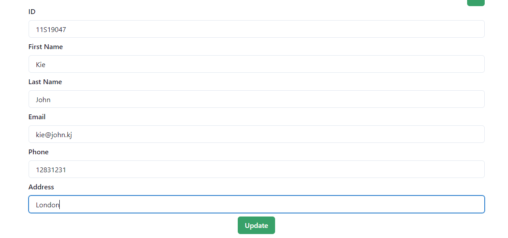

# tasksynapsis by Andreas Hatigoran

-Membuat Koneksi Database

-Schema dari database

-Method PUT, POST, DELETE, GET

-Method untuk menambahkan data

-Method untuk Update data

-Method untuk Delete data 

-Running Application

-Create Data

-Delete Data

-Updating Data

